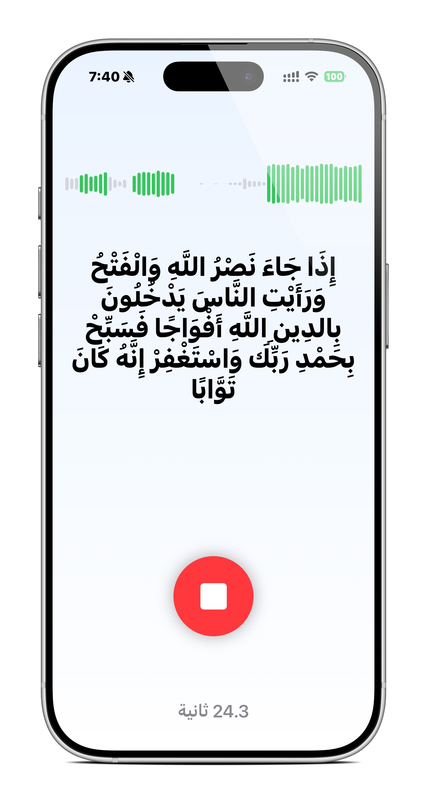

# QuranWhisperKit - Model Testing Example

A simple test application for evaluating the [Ultra Fast Tarteel CoreML](https://huggingface.co/fazalshaikh123/ultra-fast-tarteel-coreml) model for real-time Arabic Quran recitation transcription on iOS.

<p align="center">
  
  
  
</p>

<p align="center">
  
</p>

> ⚠️ **Note**: This is an experimental test application for evaluating the Tarteel model's performance. It is not a production-ready app, but rather a minimal example to help developers test and improve Arabic Quran transcription quality.

## Purpose

This project serves as a simple testing ground to:
- ✅ Test the Tarteel CoreML model on real iOS devices
- 📊 Evaluate real-time transcription accuracy for Quranic Arabic
- 🔬 Provide a minimal example for developers to experiment with
- 🤝 Encourage community contributions to improve transcription quality

## What This Is

- A **minimal working example** of WhisperKit integration
- A **testing tool** for the Tarteel model on iOS
- A **starting point** for developers to build upon
- A **reference implementation** for Arabic speech-to-text

## What This Is NOT

- ❌ A production-ready Quran app
- ❌ A fully-featured transcription service
- ❌ Optimized for all use cases
- ❌ Guaranteed to be 100% accurate

## Model Information

### Ultra Fast Tarteel CoreML

This test app uses the [Ultra Fast Tarteel CoreML](https://huggingface.co/fazalshaikh123/ultra-fast-tarteel-coreml) model, which is a WhisperKit/CoreML conversion of [OdyAsh/faster-whisper-base-ar-quran](https://huggingface.co/OdyAsh/faster-whisper-base-ar-quran), which itself is a conversion of the original [tarteel-ai/whisper-base-ar-quran](https://huggingface.co/tarteel-ai/whisper-base-ar-quran) model.

#### Model Chain
```
tarteel-ai/whisper-base-ar-quran 
  → OdyAsh/faster-whisper-base-ar-quran 
  → fazalshaikh123/ultra-fast-tarteel-coreml
```

### Performance Benchmarks

Tested on **iPhone 15 Pro Max**:

| Metric | Value |
|--------|-------|
| Audio Duration | 1 hour 50 minutes (Surah Al-Baqarah) |
| Transcription Time | ~200 seconds |
| Real-time Factor | ~0.03x (33x faster than real-time) |

The model can transcribe Arabic Quranic audio approximately **33 times faster** than the original audio duration on modern iOS devices.

## Quick Start

### Requirements

- iOS 18.0+
- Xcode 15.0+
- Swift 5.9+
- ~300MB free storage (for model download)
- Physical iOS device (simulator not recommended for audio testing)

### Installation

1. Clone the repository:
```bash
git clone https://github.com/yourusername/QuranWhisperKit.git
cd QuranWhisperKit
```

2. Open in Xcode:
```bash
open QuranWhisperKit.xcodeproj
```

3. Add WhisperKit dependency:
   - **File → Add Package Dependencies**
   - URL: `https://github.com/argmaxinc/WhisperKit.git`
   - Version: Latest

4. Build and run on your device

### Testing the Model

1. **First run**: App downloads the model (~200MB) - only happens once
2. **Tap microphone**: Start recording
3. **Recite Quran**: Speak clearly in Arabic
4. **Observe results**: See real-time transcription and waveform
5. **Stop recording**: Tap the red button
6. **Evaluate accuracy**: Check transcription quality

## Help Us Improve! 🙏

This is a **community effort** to improve Arabic Quran transcription. We need your help!

### How You Can Contribute

#### 🧪 Test and Report
- Test with different recitation styles (Hafs, Warsh, etc.)
- Try different Arabic accents and dialects
- Report accuracy issues with specific examples
- Share performance metrics from different devices

#### 🔧 Improve the Code
- Optimize transcription parameters
- Improve UI/UX for testing
- Add evaluation metrics and benchmarking tools
- Implement better error handling

#### 📊 Share Findings
- Document what works well and what doesn't
- Create datasets for testing
- Share comparison results with other models
- Write blog posts about your experiments

#### 🤝 Collaborate
- Train better models with more Quranic data
- Fine-tune parameters for better accuracy
- Explore different model architectures
- Contribute to the upstream WhisperKit project

### Known Issues & Limitations

- ⚠️ Transcription accuracy varies with recitation speed
- ⚠️ May struggle with tajweed-heavy recitations
- ⚠️ Background noise affects results
- ⚠️ Not optimized for longer continuous recitations
- ⚠️ Limited testing on older iOS devices

**Found an issue?** Please [open an issue](https://github.com/yourusername/QuranWhisperKit/issues) with:
- Device model and iOS version
- Specific surah/ayah being recited
- Expected vs actual transcription
- Any relevant audio characteristics

## Code Structure

```
QuranWhisperKit/
├── ContentView.swift          # Main UI and logic (~400 lines)
│   ├── Model loading
│   ├── Audio recording
│   ├── Real-time transcription
│   └── Waveform visualization
├── QuranWhisperKitApp.swift  # App entry point
└── Assets.xcassets/          # App assets
```

### Key Components

- **Model Loading**: Downloads and caches the Tarteel model from HuggingFace
- **Audio Processing**: Real-time audio capture with VAD (Voice Activity Detection)
- **Transcription**: Uses WhisperKit for on-device inference
- **UI**: Minimal SwiftUI interface for testing

## Architecture

```
┌─────────────────┐
│   SwiftUI UI    │
└────────┬────────┘
         │
┌────────▼────────┐
│   WhisperKit    │
└────────┬────────┘
         │
┌────────▼────────┐
│ Tarteel CoreML  │
└────────┬────────┘
         │
┌────────▼────────┐
│  AVFoundation   │
│   (Audio I/O)   │
└─────────────────┘
```

## Experimentation Ideas

Want to extend this project? Here are some ideas:

- 📈 Add accuracy metrics and evaluation tools
- 🎯 Implement A/B testing with different models
- 📝 Save and compare transcription results
- 🔊 Support audio file input for batch testing
- 📊 Create benchmarking dashboard
- 🎤 Add different audio quality settings
- 🌐 Compare with cloud-based alternatives
- 🔬 Implement confidence scores

## Model Credits

- **Original Model**: [Tarteel AI](https://huggingface.co/tarteel-ai) - Fine-tuned Whisper for Quranic Arabic
- **Faster-whisper Conversion**: [OdyAsh](https://huggingface.co/OdyAsh) - Optimized inference
- **WhisperKit/CoreML Conversion**: [fazalshaikh123](https://huggingface.co/fazalshaikh123) - iOS compatibility

Special thanks to:
- [WhisperKit](https://github.com/argmaxinc/WhisperKit) by Argmax, Inc.
- [Tarteel AI](https://www.tarteel.ai/) for their pioneering work
- The Hugging Face community

## Resources

- [WhisperKit Documentation](https://github.com/argmaxinc/WhisperKit)
- [Tarteel Model Card](https://huggingface.co/fazalshaikh123/ultra-fast-tarteel-coreml)
- [Original Tarteel AI Research](https://www.tarteel.ai/)
- [CoreML Documentation](https://developer.apple.com/documentation/coreml)

## Privacy

- ✅ All processing happens **on-device**
- ✅ No data sent to external servers
- ✅ Audio is not stored or saved
- ✅ Microphone access only during active recording

## Contributing

We welcome all contributions! Whether you're:
- 🐛 Reporting bugs
- 💡 Suggesting improvements
- 🔧 Submitting code fixes
- 📝 Improving documentation
- 🧪 Sharing test results

### How to Contribute

1. Fork the repository
2. Create a feature branch (`git checkout -b feature/improvement`)
3. Make your changes
4. Test thoroughly on real devices
5. Commit with clear messages (`git commit -m 'Add: improved VAD detection'`)
6. Push to your fork (`git push origin feature/improvement`)
7. Open a Pull Request with detailed description

### Contribution Guidelines

- Keep the code simple and readable
- Test on physical devices
- Document your changes
- Share performance impacts
- Include test cases if applicable

## Discussion & Community

Have questions or ideas? Let's discuss!
- 💬 [GitHub Discussions](https://github.com/yourusername/QuranWhisperKit/discussions)
- 🐛 [Issue Tracker](https://github.com/yourusername/QuranWhisperKit/issues)
- 📧 Reach out to maintainers

## License

MIT License - see [LICENSE](LICENSE) file for details.

**Note**: The Tarteel model has its own licensing. Please review the [model page](https://huggingface.co/fazalshaikh123/ultra-fast-tarteel-coreml) for model-specific terms.

## Citation

If you use this test app or the Tarteel model in your research, please cite:

```bibtex
@software{quranwhisperkit2025,
  title = {QuranWhisperKit: A Test Application for Arabic Quran Transcription},
  author = {Your Name},
  year = {2025},
  url = {https://github.com/yourusername/QuranWhisperKit}
}
```

---

<p align="center">
  <strong>This is a community testing project. Your contributions help improve Quranic Arabic transcription for everyone!</strong>
</p>

<p align="center">
  Built with ❤️ for the Muslim developer community
</p>
